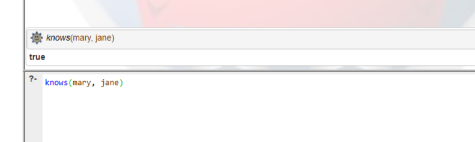
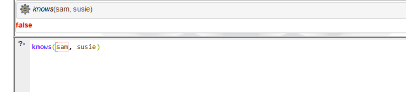
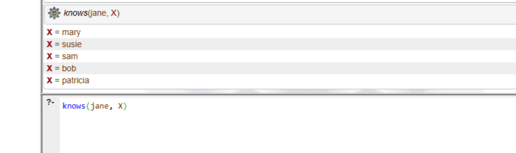
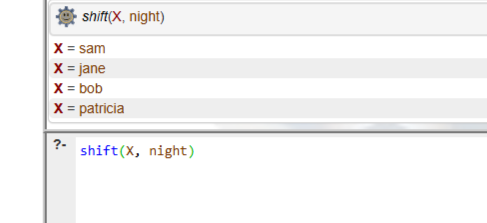

# Отчет по лабораторным работам
**Выполнил:** Коницкий Антон  
**Группа:** ЭВМб-23-1  

## Лабораторная работа 1
Вариант 7: Мэри, Сьюзи, Джейн работают в дневную смену. Сэм, Джейн, Боб, Патриция работают в вечернюю смену. Знают друг друга те, кто работает в одну смену.

### Результаты
1. Проверка знакомства Мэри и Джейн:

2. Проверка знакомства людей из разных смен:

3. Поиск всех знакомых Джейн:

4. Поиск всех сотрудников ночной смены:

**Вывод:** Изучен базовый синтаксис. Освоено использование фактов и логических правил для определения связей.
