# Отчет по лабораторным работам
**Выполнил:** Коницкий Антон  
**Группа:** ЭВМб-23-1  

## Лабораторная работа 1
**Вариант 7:** Мэри, Сьюзи, Джейн работают в дневную смену. Сэм, Джейн, Боб, Патриция работают в вечернюю смену. Знают друг друга те, кто работает в одну смену.

### Результаты
1. Проверка знакомства Мэри и Джейн:

2. Проверка знакомства людей из разных смен:

3. Поиск всех знакомых Джейн:

4. Поиск всех сотрудников ночной смены:

**Вывод:** Изучен базовый синтаксис. Освоено использование фактов и логических правил для определения связей.

## Лабораторная работа 2
**Вариант 15:** Найти сумму элементов списка, стоящих на нечетных местах.  
**Вариант 23:** Удалить из списка максимальный элемент.

**Декларативная интерпретация (15):** Сумма элементов на нечетных местах пустого списка равна 0. Для непустого списка сумма состоит из первого элемента плюс сумма нечетных позиций хвоста без его первого элемента.  
**Процедурная интерпретация (15):** Программа отсекает первые два элемента (нечетную и четную позиции), отправляет хвост в рекурсию, а затем прибавляет значение нечетного элемента к результату.

**Декларативная интерпретация (23):** Результатом является исходный список, в котором отсутствует одно вхождение максимального числового значения.  
**Процедурная интерпретация (23):** Программа рекурсивно обходит список для поиска наибольшего элемента, а затем применяет функцию удаления первого встреченного совпадения с найденным максимумом.

### Результаты
1. Сумма нечетных позиций стандартного списка:
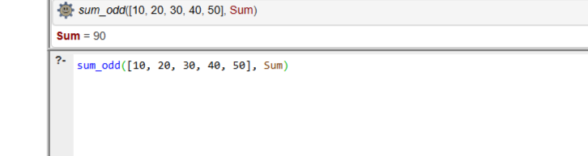

2. Сумма для пустого списка:
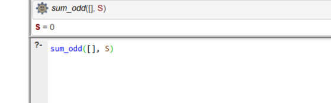

3. Удаление максимального элемента:
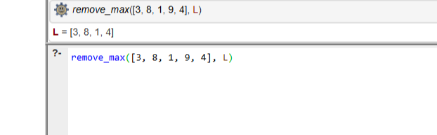

4. Удаление максимума при дубликатах (удаляется только один):
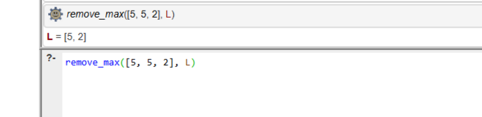

**Вывод:** Освоена работа с рекурсивными структурами данных, написание алгоритмов поиска и модификации списков.

## Лабораторная работа 3
**Вариант 8:** Электронный магазин (Учет товаров).

### Результаты
1. Инициализация стартовой БД:
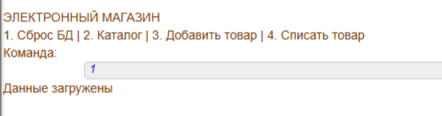

2. Вывод каталога товаров:
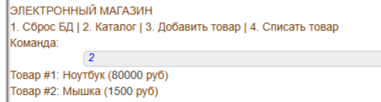

3. Регистрация нового товара:
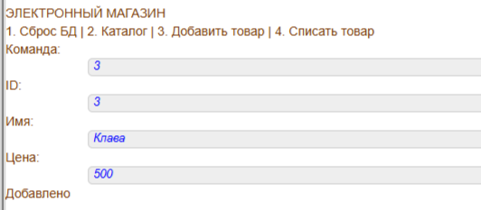

4. Каскадное списание товара из каталога и остатков:
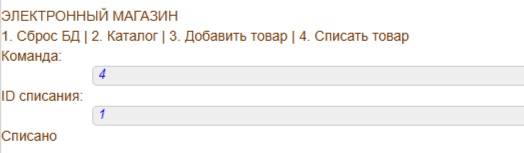

**Вывод:** Изучена работа с динамическими предикатами. Написано консольное меню. Использованы встроенные предикаты модификации базы `assertz` и `retractall`.

## Лабораторная работа 4
**Вариант 3:** Сгенерировать списки-палиндромы, состоящие из чисел заданного диапазона.

### Результаты
1. Генерация палиндромов оптимизированным методом:
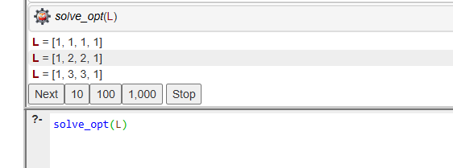

2. Оценка трудоемкости полного перебора:
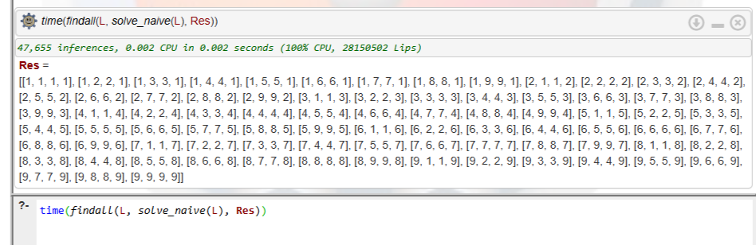

3. Оценка трудоемкости оптимизированного алгоритма:
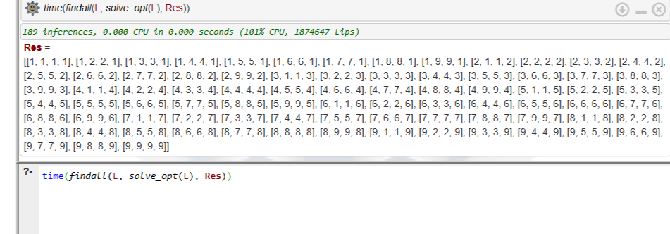

**Вывод:** Использование математических свойств палиндрома (зеркальность) позволило генерировать только половину списка, что сократило пространство перебора и количество операций вывода (inferences) на порядки.

## Лабораторная работа 5 (ЭС)
**Задание:** Разработать экспертную систему прямого вывода. Тема: "Выбор смартфона".
**Особенность:** База знаний является логически полной. Добавлено правило-обработчик для перехвата неверных команд пользователя.

### Результаты
1. Сценарий 1 (iOS + Бюджет не ограничен):
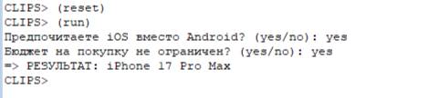

2. Сценарий 2 (Android + Нужна камера):
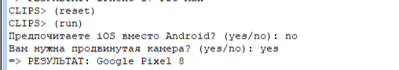

3. Сценарий 3 (Android + Бюджетник):
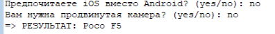

4. Срабатывание защиты от некорректного ввода:
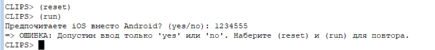

**Вывод:** Изучена среда CLIPS. Реализованы продукционные правила `defrule`, освоен механизм инициализации состояний через `deffacts` и прямой логический вывод.
